# Lab6Web
Latihan_4 13-4-2022

## Membuat layout web sederhana menggunakan css frameword (Twitter Bootstrap)

Pertama unduhh terlebih dahulu bootstrapnya melalui link berikut `http://getbootstrap.com/` jika sudah kemudian extrat file nya.
Setelah itu kita buat buat file html baru dengan nama `index.html` kemudian masukan kodingan berikut, disitu saya menggunakan bootstrap pada saat membuat navbar

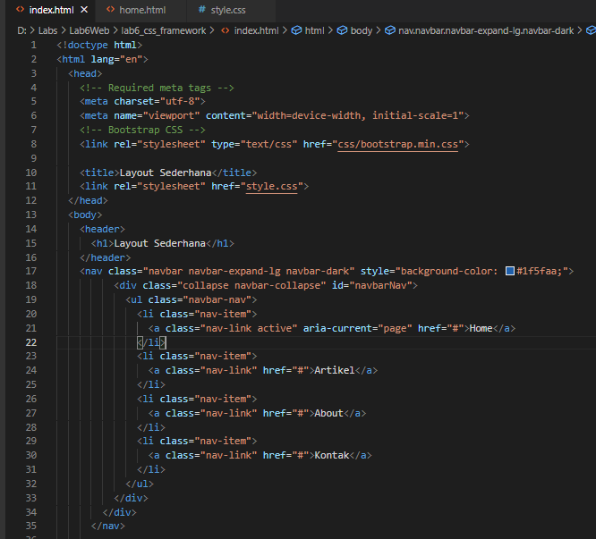

dan membuat isi dari body menggunkan bootstrap `jimbotron`

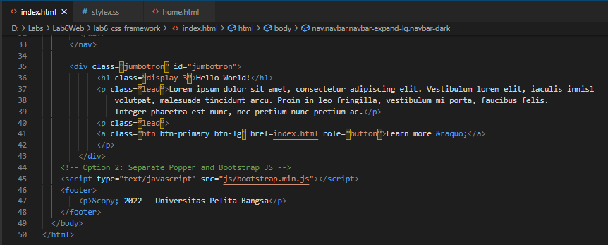

deklarasikan dengan CSS

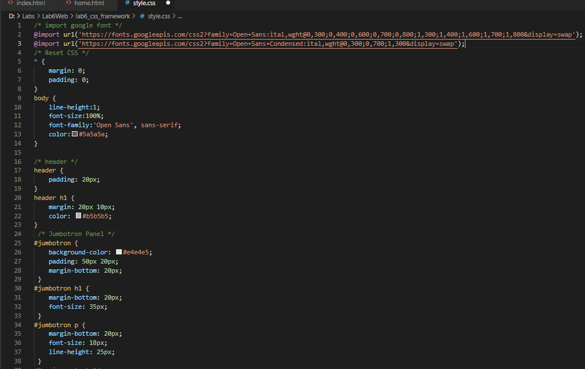

tampilan website nya seperti ini

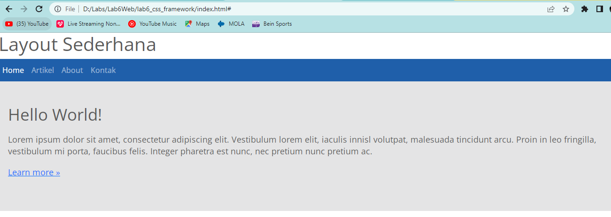

Kemudian membuat artikel, masukan kodinganya seperti ini

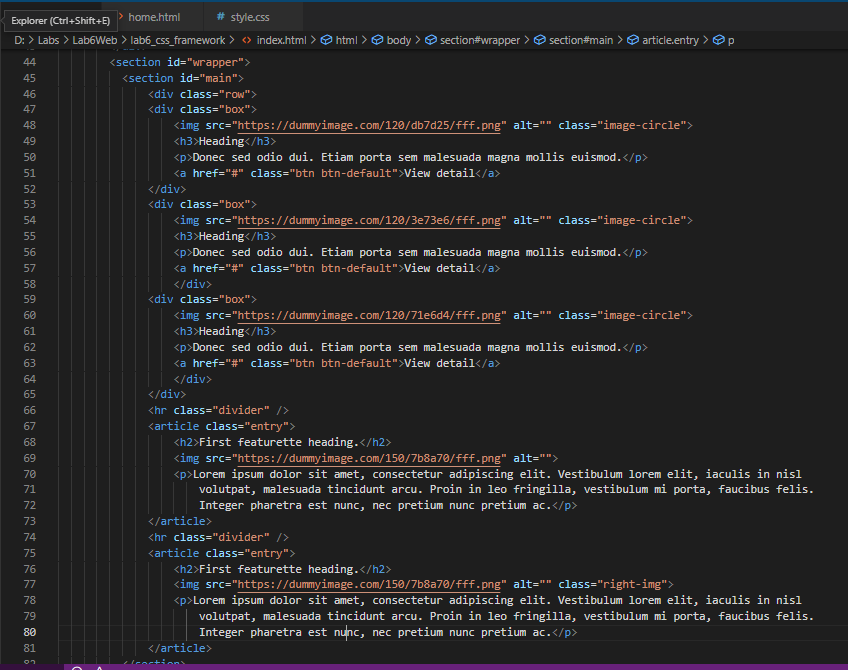

deklarasikan dengan CSS

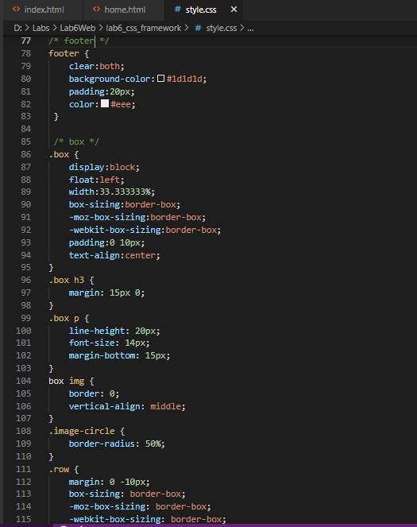

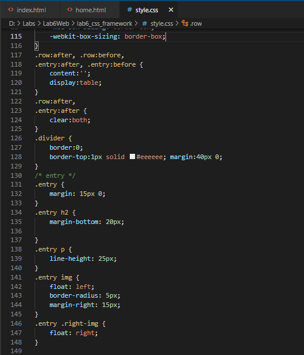

tampilan websitenya seperti ini

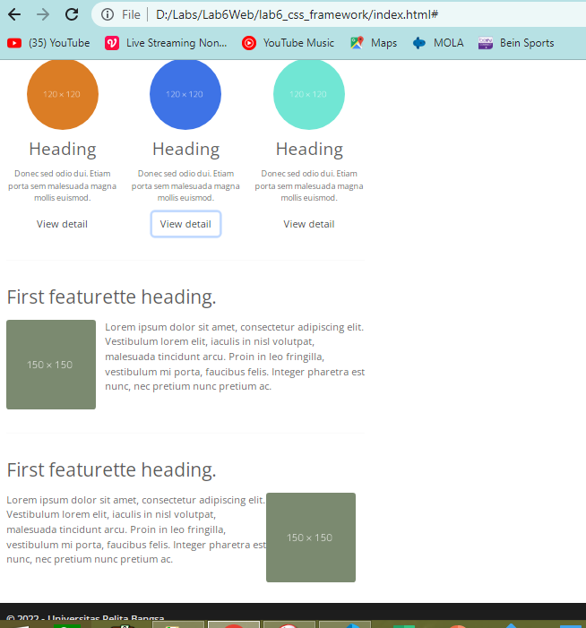

Membuat Widget Sidebar, disini saya menggunkan bootstrap `list-group` kodinganya seperti ini

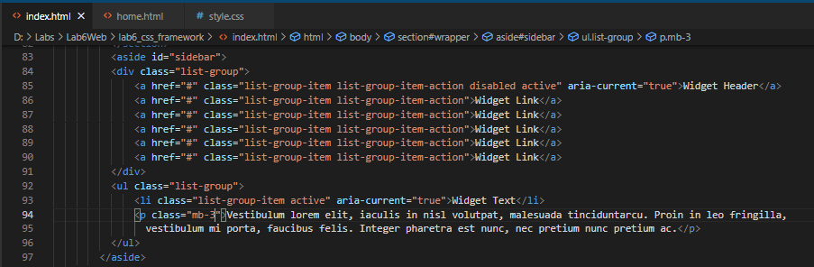

deklarasikan dengan CSS

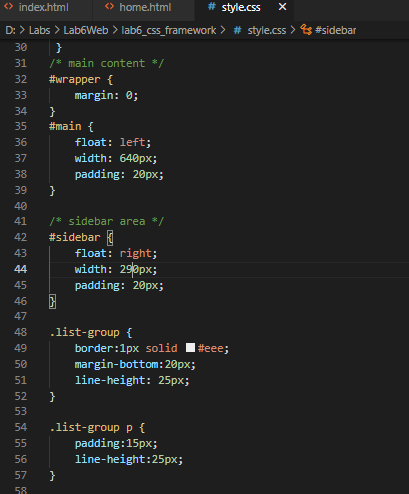

tampilan websitenya seperti ini

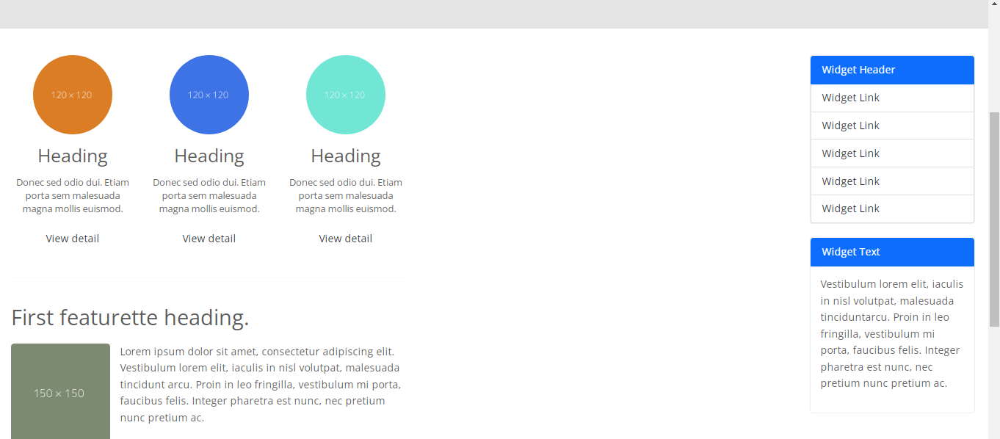

### Tampilan Keseluruhan Website

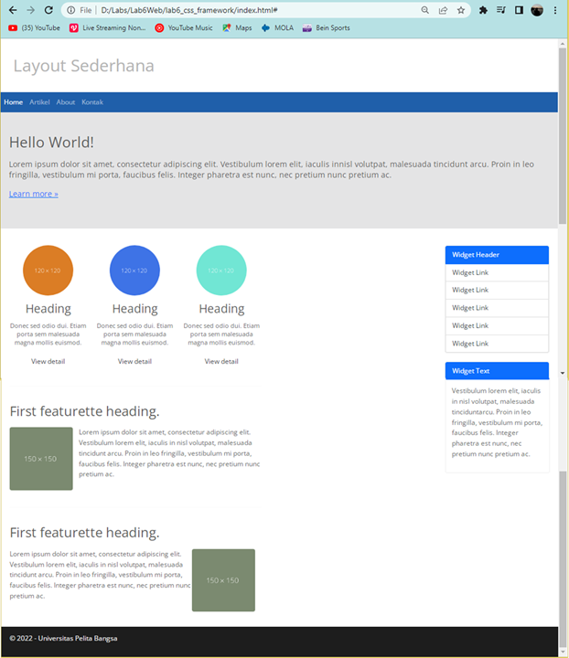

Itu adalah sedikit contoh dari penggunaan bootstrap